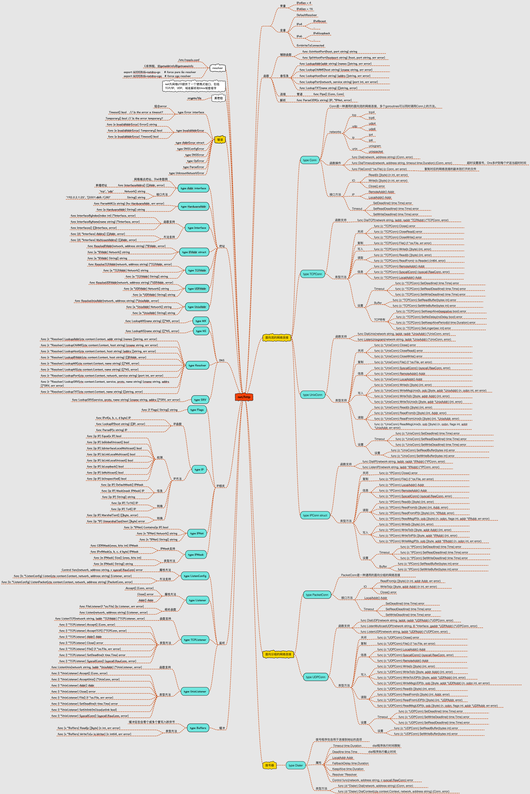
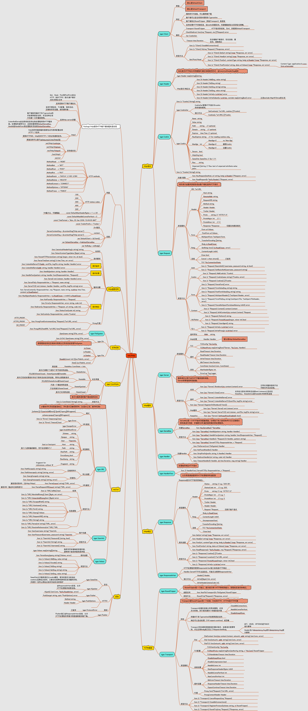
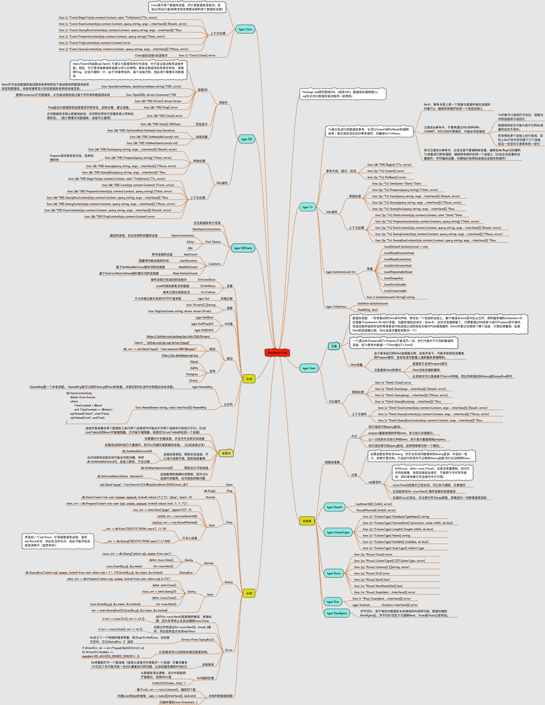
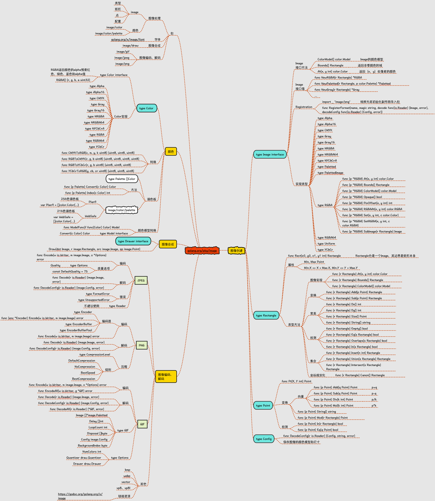
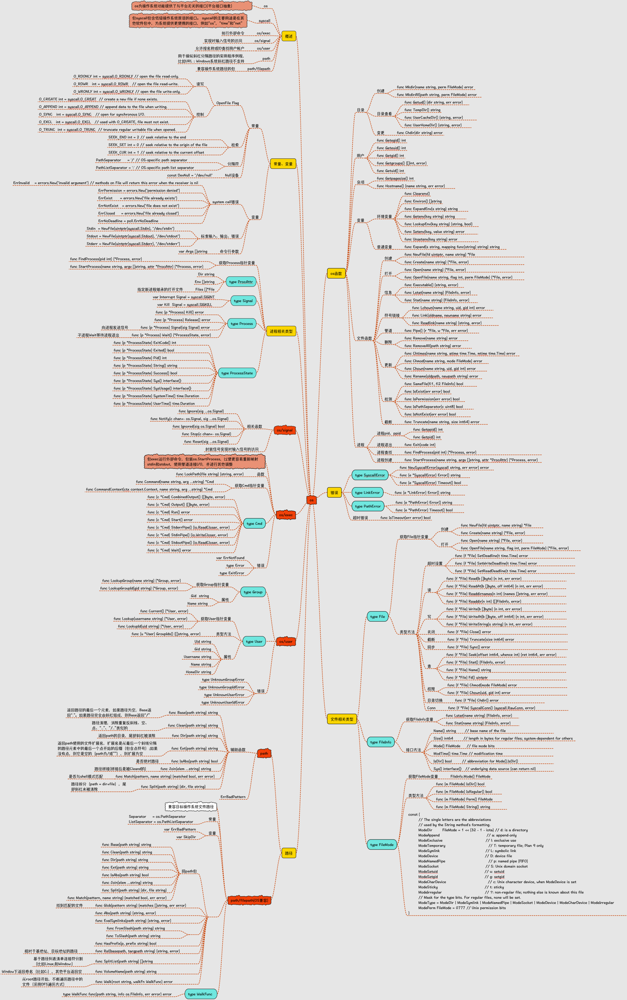
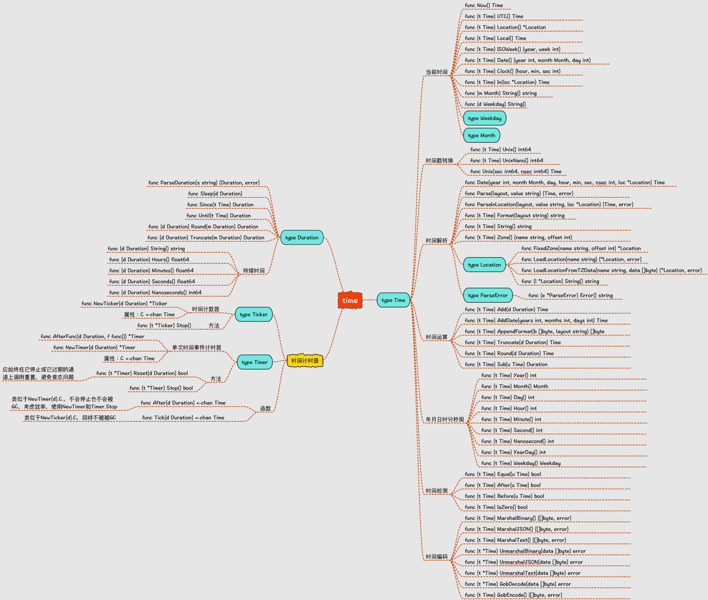
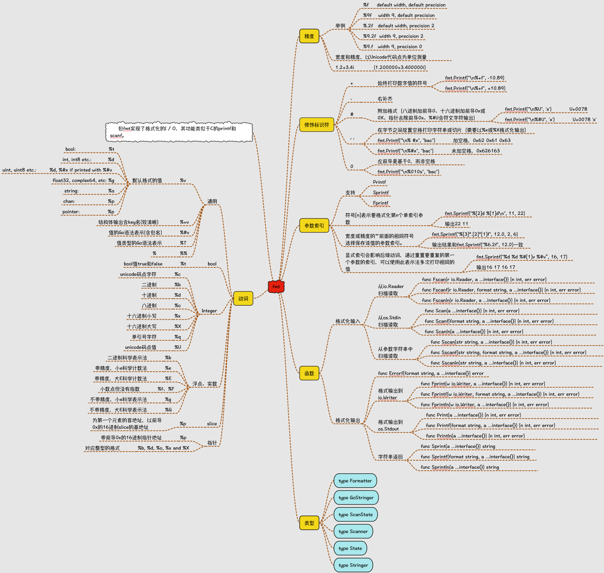
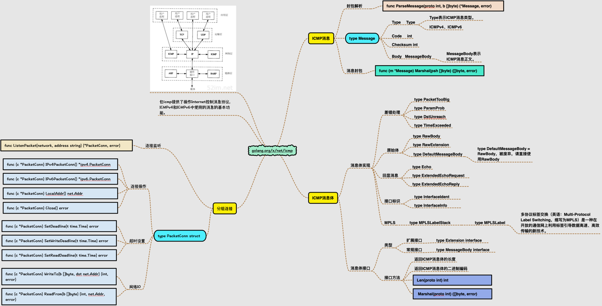

## studious

keep learning...

## 这个仓库用来作甚？

> 目前主要是存储在学习golang编程中的一些小结，但未梳理成文在记录在 https://tkstorm.com 上的内容

## Golang标准库包记录
- [net](#net)
- [net/http](#nethttp)
- [bufio](#bufio)
- [database/mysql](#databasemysql)
- [flag](#flag)
- [image](#image)
- [io](#io)
- [os](#os)
- [strings](#strings)
- [time](#time)
- [fmt](#fmt)
- [x/icmp](#xicmp)

## 图示

### net

### net/http

### bufio

### database/mysql

### flag

### image

### io

### os

### strings

### time

### fmt

### x/icmp

